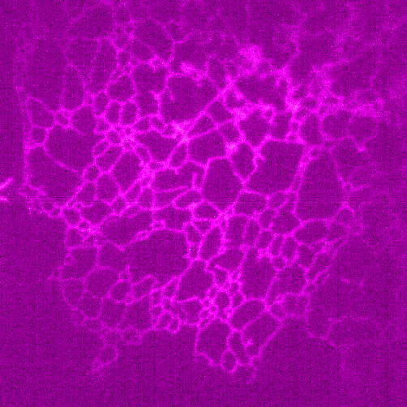
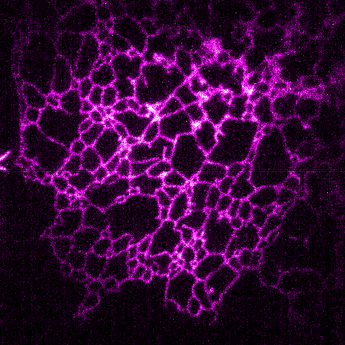

# IPIC-APN: Adaptive Percentage Normalization


<p align="center">
  
  <br>
  <em>The IPIC-APN User Interface</em>
</p>

## Introduction

**IPIC-APN** is an ImageJ/Fiji plugin specifically designed for **unsupervised learning denoising**.

It utilizes the Adaptive Percentage Normalization (APN) algorithm to prepare raw image data for downstream analysis. By automatically calculating optimal intensity thresholds, this plugin **effectively mitigates the influence of baseline drift and hot pixels**, providing a cleaner and more consistent input for deep learning models or advanced analysis.

## 📥 Installation

1.  **Download**: Locate the file named `Adaptive_Percentage-Normalization-1.0.0.jar` in the file list above (the main directory of this repository) and download it.
2.  **Install**: Copy the downloaded `.jar` file into the `plugins/` folder of your ImageJ or Fiji directory.
3.  **Restart**: Restart ImageJ/Fiji to complete the installation.

## 🚀 Usage

1.  **Open Image**: Load your target image or stack (supports 8-bit, 16-bit, and 32-bit).
2.  **Run Plugin**: Navigate to the menu bar:
    `Plugins > APN Tool > Run APN`.
3.  **Process**:
    * Click **Start Processing**.
4.  **Output**:
    * The plugin generates a normalized version of the image/stack.
    * It also displays the histogram with the calculated percentile thresholds used for the normalization.

## 📊 Comparison: Raw vs. APN

Below is a comparison showing the removal of baseline noise and hot pixel artifacts.

| Raw Image | APN Processed |
| :---: | :---: |
|  |  |


## 🛠 Building from Source

This project is managed by **Maven**. To compile the plugin yourself:

1.  Clone the repository:
    ```bash
    git clone [https://github.com/YourUsername/APN_Adaptive-Percentage-Normalization.git](https://github.com/YourUsername/APN_Adaptive-Percentage-Normalization.git)
    ```
2.  Navigate to the project directory containing the `pom.xml`.
3.  Build using Maven:
    ```bash
    mvn clean package
    ```
4.  The compiled `.jar` file will be located in the `target/` directory.

## 📄 License

This project is licensed under the MIT License - see the [LICENSE](LICENSE) file for details.
