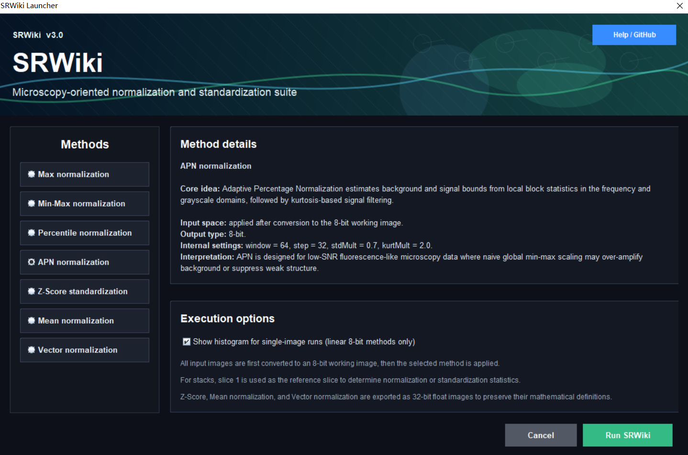

# SR-Wiki Normalization

  
   
  <em>The SR-Wiki Normalization User Interface</em>

---

## 📖 Overview

**SR-Wiki Normalization** is an ImageJ/Fiji plugin designed for robust preprocessing of biological microscopy images, with a particular emphasis on low signal-to-noise ratio (low-SNR) fluorescence data.

Microscopy images often suffer from baseline drift, uneven background, hot pixels, and weak structural signals that are easily overwhelmed by noise. Conventional global normalization strategies such as Min-Max or Max normalization implicitly assume stable background and well-behaved intensity distributions, which are rarely satisfied in real experimental conditions.

To address this, SR-Wiki integrates a set of seven normalization and standardization methods within a unified interface, centered around the **Adaptive Percentage Normalization (APN)** algorithm. The plugin enables both display-oriented enhancement and analysis-oriented standardization, making it suitable for downstream tasks such as unsupervised deep learning denoising, quantitative measurement, and visualization.

---

## 📥 Installation

1. Download the latest `SRWiki_Normalization.jar`
2. Copy it into:ImageJ/Fiji/plugins/
3. Restart ImageJ/Fiji
4. Launch via:Plugins > SRWiki > SRWiki Normalization

---

## ⚙️ Usage Workflow

1. Open a grayscale image or stack in ImageJ/Fiji  
2. Launch the plugin  
3. Select a normalization or standardization method  
4. If using Percentile mode, set lower and upper thresholds  
5. Optionally enable histogram visualization  
6. Click **Run SRWiki**  
7. A processed image or stack will be generated  

---

## 📊 Normalization and Standardization Modes

| Mode | Mathematical Principle | Best Used For |
| :--- | :--- | :--- |
| **APN (Adaptive)** | $x' = \dfrac{x - X_{\min}^{\text{(bg)}}}{X_{\max}^{\text{(sig)}} - X_{\min}^{\text{(bg)}}} \times 255$ | Low-SNR microscopy, real biological data |
| **Percentile** | $x' = \mathrm{clip}\left(\dfrac{x - P_{\text{low}}}{P_{\text{high}} - P_{\text{low}}}\,0\,1\right)\times 255$ | Controlled removal of outliers |
| **Min-Max** | $x' = \dfrac{x - x_{\min}}{x_{\max} - x_{\min}} \times 255$ | Clean images with stable intensity range |
| **Max Only** | $x' = \dfrac{x}{x_{\max}} \times 255$ | Pre-calibrated data with zero background |
| **Z-Score** | $z = \dfrac{x - \mu}{\sigma}$ | Deep learning preprocessing |
| **Mean** | $x' = \dfrac{x - \mu}{x_{\max} - x_{\min}}$ | Centered normalization for analysis |
| **Vector** | $x' = \dfrac{x}{\|x\|_2}$ | Energy normalization / feature comparison |

---

## ⚙️ Parameters

### Percentile Parameters (active only in Percentile mode)

- **Lower Percentile (%)**
- Default: `1.0`
- Intensities below this value are mapped to 0  

- **Upper Percentile (%)**
- Default: `99.8`
- Intensities above this value are mapped to 255  

These parameters allow manual control over intensity clipping when automatic methods are not preferred.

---
